# Cover Page

**ANKARA YILDIRIM BEYAZIT UNIVERSITY**
**FACULTY OF ENGINEERING AND NATURAL SCIENCES**

---

## DIABETES PREDICTION USING MACHINE LEARNING

### A Comprehensive Study on the CDC BRFSS 2015 Health Indicators Dataset

---

**İbrahim Hakkı Keleş — 22050351013**

**IE410 ADVANCED COMPUTER PROGRAMMING**
**DEPARTMENT OF INDUSTRIAL ENGINEERING**

**Instructor:** Prof. Dr. Servet SOYGÜDER
**Teaching Assistant:** Bülent HERDEM

---

**May 2026**
**ANKARA**

\newpage

# ABSTRACT

Diabetes mellitus is one of the most prevalent chronic diseases worldwide, with approximately 537 million adults currently living with the condition according to the International Diabetes Federation. Early detection of individuals at high risk of diabetes is critical for effective preventive intervention, yet many existing prediction models suffer from small sample sizes (e.g., the Pima Indians Dataset with only 768 records) or narrow clinical-only feature spaces.

This project develops a comprehensive machine learning-based prediction system to identify individuals at high risk of diabetes using the **CDC Behavioral Risk Factor Surveillance System (BRFSS) 2015** dataset, which contains health survey data from **253,680 individuals across 21 features**. The dataset is uniquely valuable in that it integrates medical indicators (blood pressure, cholesterol, BMI), behavioral factors (physical activity, smoking, dietary habits), and socioeconomic dimensions (income, education, healthcare access).

The project follows a systematic three-study CRISP-DM workflow. In **Study-1**, comprehensive data preparation and exploratory data analysis were performed, including outlier detection using both Z-score and Interquartile Range (IQR) methods, and feature selection via three complementary approaches: SelectKBest (Chi-Square), Recursive Feature Elimination (RFE), and Principal Component Analysis (PCA). In **Study-2**, six candidate classifiers were initially screened on a 5,000-sample subset using accuracy and training time as filter criteria; three were eliminated with data-driven justification. The remaining three — Logistic Regression, Decision Tree, and Random Forest — were systematically tuned using GridSearchCV and RandomizedSearchCV with Stratified 5-Fold Cross-Validation. Nested Cross-Validation was applied to obtain unbiased generalization estimates. In **Study-3**, the tuned models were trained on the full dataset and evaluated using a multi-metric protocol including Confusion Matrix, Classification Report, ROC Curve, Calibration Curve, and Threshold Optimization. The severe class imbalance (86.07% healthy vs 13.93% diabetic) was addressed through three orthogonal strategies: `class_weight='balanced'`, `class_weight='balanced_subsample'` for the Random Forest anomaly, and Synthetic Minority Over-sampling Technique (SMOTE).

To enhance clinical interpretability, four explainable AI techniques were integrated: Gini Feature Importance, SHAP (SHapley Additive exPlanations) values, Permutation Importance, and Partial Dependence Plots (both 1D and 2D interactions).

The final **Logistic Regression Balanced** model achieved an **AUC of 0.8226**, a **Recall of 0.762** on the diabetic class, and an **F1 score of 0.443**, satisfying the project's primary objective of catching at least 70% of diabetic patients in a screening setting. The top predictive features identified are **General Health, High Blood Pressure, BMI, Age, and Cholesterol level**, consistent with established medical literature. The project deliverable consists of a modular Python codebase organized in a layered MVC-adapted architecture, three reproducible Jupyter notebooks, persisted model artifacts (pickle), and comprehensive technical documentation.

**Keywords:** Machine Learning, Diabetes Prediction, Class Imbalance, SMOTE, SHAP, Logistic Regression, Random Forest, Decision Tree, Hyperparameter Tuning, Explainable AI, CDC BRFSS

\newpage

# 1. INTRODUCTION

## 1.1 Project Overview

Diabetes is a chronic metabolic disorder that affects how the body converts food into energy. When undiagnosed or poorly managed, it leads to severe complications including cardiovascular disease, kidney failure, neuropathy, blindness, and lower-limb amputation. According to the World Health Organization, diabetes is the seventh leading cause of death globally, with an estimated **1.5 million deaths** directly attributed to the disease each year.

Early identification of at-risk individuals is one of the most effective public-health interventions available: studies such as the Diabetes Prevention Program (DPP) have demonstrated that lifestyle modification in pre-diabetic individuals can reduce progression to Type 2 diabetes by up to **58%**. However, conventional clinical screening relies on glycemic tests (HbA1c, fasting glucose) that require laboratory infrastructure and patient initiative — both of which are scarce in low-resource and asymptomatic populations.

Machine learning offers a low-cost, scalable alternative: a predictive model trained on widely available **survey-style health indicators** (blood pressure status, BMI, lifestyle behaviors, socioeconomic factors) can flag at-risk individuals for follow-up testing, thereby maximizing the diagnostic yield of limited clinical resources.

This project develops such a predictive system using the CDC BRFSS 2015 dataset, which captures health survey responses from a quarter-million U.S. residents across medical, behavioral, and socioeconomic dimensions. The deliverable is a fully reproducible, layered, and interpretable machine learning pipeline that produces both binary classifications and calibrated probability estimates, accompanied by patient-level explanations derived from SHAP values.

## 1.2 Project Objectives

The project pursues four concrete, measurable objectives:

| # | Objective | Success Criterion |
|---|-----------|-------------------|
| O1 | Build a binary classifier that distinguishes diabetic from non-diabetic individuals using only survey indicators | Test-set AUC ≥ 0.80 |
| O2 | Achieve high recall on the diabetic class to minimize missed cases (false negatives) in a screening context | Recall (diabetic) ≥ 0.70 |
| O3 | Produce interpretable explanations of model predictions for clinical trust | SHAP + Permutation Importance reports |
| O4 | Deliver a reproducible, modular codebase with clear documentation | Layered scripts/ modules + technical report |

Each objective is revisited explicitly in Section 8.3, where the achieved performance is compared against the corresponding success criterion.

## 1.3 Project Scope

**In Scope:**

- Binary classification (diabetes vs no-diabetes); the original three-class formulation (no-diabetes / pre-diabetes / diabetes) is collapsed to binary to match the available `Diabetes_binary` target.
- Three classifier families: Logistic Regression (linear), Decision Tree (rule-based), Random Forest (ensemble).
- Class-imbalance treatment via three orthogonal strategies: class weighting, balanced subsample (RF-specific), and SMOTE.
- Hyperparameter tuning via GridSearchCV and RandomizedSearchCV.
- Explainable AI via Gini importance, SHAP, Permutation Importance, and Partial Dependence Plots.

**Out of Scope:**

- Deep learning (neural networks) — excluded because the tabular, low-dimensional nature of the data does not justify the added complexity; tree-based and linear models are well-established to outperform neural networks on such datasets.
- Online learning / real-time deployment — the model is delivered as a serialized pickle artifact intended for batch use.
- Multi-class formulation including pre-diabetes — the available label is binary.
- External validation on independent populations (e.g., non-U.S. cohorts).

## 1.4 Methodology (CRISP-DM Framework)

The project follows the **Cross-Industry Standard Process for Data Mining (CRISP-DM)** framework, the de-facto industrial methodology for data science projects. The six phases are mapped to the three studies as follows:

| CRISP-DM Phase | Study | Activities |
|----------------|-------|------------|
| 1. Business Understanding | Section 1 | Objectives, scope, success criteria |
| 2. Data Understanding | Study-1 | EDA, distribution, correlation, outliers |
| 3. Data Preparation | Study-1 | Outlier handling, feature selection, scaling, train-test split |
| 4. Modeling | Study-2 + Study-3 | Screening, tuning, training, class-imbalance treatment |
| 5. Evaluation | Study-3 + Section 8 | Multi-metric assessment, threshold optimization, calibration |
| 6. Deployment | Section 9 | Pickle serialization, demo, production considerations |

## 1.5 Report Structure

The remainder of this report is organized as follows:

- **Section 2** justifies the choice of the CDC BRFSS 2015 dataset and describes its 21 features.
- **Section 3** documents the project architecture, including the layered folder structure and the responsibilities of each reusable Python module under `scripts/`.
- **Sections 4–6** present the three studies in technical detail, with code excerpts and rationale.
- **Section 7** dedicates a full chapter to explainable AI techniques.
- **Section 8** presents results, discussion, and objective fulfillment.
- **Sections 9–10** cover deployment, conclusions, and future work.
- **Appendices** contain full code listings, all visualizations, hyperparameter details, and module documentation.

\newpage

# 2. DATASET SELECTION AND JUSTIFICATION

## 2.1 Problem Domain

Diabetes is fundamentally a **multifactorial** disease: its onset is influenced not only by genetic predisposition and metabolic markers, but also by behavioral choices (diet, exercise, smoking, alcohol), environmental exposures, and socioeconomic conditions (food access, healthcare affordability, education). A predictive model that ignores any of these dimensions is by construction incomplete.

This insight directly informs the dataset selection: the model is only as comprehensive as the features it is trained on. A dataset limited to clinical biomarkers (glucose, insulin) captures only the *outcome* side of diabetes risk; a dataset that additionally includes lifestyle and socioeconomic indicators captures the *upstream causes*, which are precisely what a screening tool needs to detect *before* glycemic dysregulation becomes measurable.

## 2.2 Dataset Comparison: Pima Indians vs CDC BRFSS

The de-facto benchmark dataset for diabetes prediction in academic literature is the **Pima Indians Diabetes Dataset**, originally collected by the National Institute of Diabetes and Digestive and Kidney Diseases. While historically valuable, this dataset has several limitations that motivated the choice of an alternative.

| Dimension | Pima Indians | CDC BRFSS 2015 (Selected) |
|-----------|--------------|---------------------------|
| Sample size | 768 records | **253,680 records (330× larger)** |
| Population | Pima Indian women, age ≥ 21 | Diverse U.S. adults, all ages |
| Feature count | 8 (clinical only) | **21 (medical + behavioral + socioeconomic)** |
| Feature scope | Pregnancies, glucose, BP, skin thickness, insulin, BMI, DPF, age | + Smoking, exercise, diet, income, education, healthcare access |
| Generalizability | Single-ethnicity, single-gender | Population-representative survey |
| Class balance | 65% / 35% | 86% / 14% (challenging but realistic) |

The CDC BRFSS dataset's larger sample size enables more statistically reliable hyperparameter tuning and cross-validation, while its broader feature space captures the multifactorial nature of the disease. The trade-off is the more severe class imbalance, which is addressed throughout Section 6.

## 2.3 CDC BRFSS 2015 Overview

The **Behavioral Risk Factor Surveillance System (BRFSS)** is the largest continuously-conducted telephone health survey system in the world, administered annually by the United States Centers for Disease Control and Prevention (CDC) since 1984. The 2015 release used here was preprocessed and made available on Kaggle by Alex Teboul.

The dataset comprises **253,680 rows** (survey respondents) and **22 columns**: one binary target (`Diabetes_binary`, 0 = no diabetes, 1 = diabetes) and 21 features. The features fall into three semantic groups:

| Group | Features | Type |
|-------|----------|------|
| **Medical history** | HighBP, HighChol, CholCheck, Stroke, HeartDiseaseorAttack | Binary 0/1 |
| **Anthropometric** | BMI | Continuous (12–98) |
| **Lifestyle / Behavior** | Smoker, PhysActivity, Fruits, Veggies, HvyAlcoholConsump | Binary 0/1 |
| **Healthcare access** | AnyHealthcare, NoDocbcCost | Binary 0/1 |
| **Self-rated health** | GenHlth, MentHlth, PhysHlth, DiffWalk | Ordinal / Counts |
| **Demographic** | Sex, Age, Education, Income | Categorical / Ordinal |

## 2.4 Feature Descriptions

A subset of the most consequential features, with their value ranges and clinical meaning, is summarized below.

| Feature | Type | Range | Clinical Meaning |
|---------|------|-------|------------------|
| `HighBP` | Binary | 0/1 | Diagnosed high blood pressure |
| `HighChol` | Binary | 0/1 | Diagnosed high cholesterol |
| `BMI` | Continuous | 12–98 | Body Mass Index (kg/m²) |
| `Smoker` | Binary | 0/1 | Smoked ≥ 100 cigarettes lifetime |
| `Stroke` | Binary | 0/1 | History of stroke |
| `HeartDiseaseorAttack` | Binary | 0/1 | History of CHD or MI |
| `PhysActivity` | Binary | 0/1 | Physical activity in past 30 days |
| `Fruits` | Binary | 0/1 | Consumes fruit ≥ 1× per day |
| `Veggies` | Binary | 0/1 | Consumes vegetables ≥ 1× per day |
| `GenHlth` | Ordinal | 1–5 | Self-rated general health (1=excellent, 5=poor) |
| `MentHlth` | Count | 0–30 | Days of poor mental health past 30 |
| `PhysHlth` | Count | 0–30 | Days of poor physical health past 30 |
| `DiffWalk` | Binary | 0/1 | Difficulty walking or climbing stairs |
| `Age` | Ordinal | 1–13 | Age category (1=18–24, 13=80+) |
| `Education` | Ordinal | 1–6 | Education level (1=never attended, 6=college graduate) |
| `Income` | Ordinal | 1–8 | Income bracket (1=<$10k, 8=≥$75k) |

## 2.5 Class Distribution Analysis

The target variable `Diabetes_binary` exhibits a substantial class imbalance:

- **Healthy (0):** 218,334 records (86.07%)
- **Diabetic (1):** 35,346 records (13.93%)
- **Imbalance ratio:** approximately **6.18 : 1**

This imbalance is **realistic** (it mirrors actual U.S. diabetes prevalence) but **technically challenging**: any classifier optimizing accuracy alone will be tempted to predict "healthy" for every individual and still achieve **86.07% accuracy** — a phenomenon known as the **Accuracy Paradox**, discussed in detail in Section 6.3. Three orthogonal mitigation strategies are tested in Section 6.

\newpage

# 3. PROJECT ARCHITECTURE

## 3.1 Folder Structure

The project follows a **layered (MVC-adapted) architecture** that separates concerns by responsibility. The top-level structure is:

```
Diabetes Prediction Week1/
│
├── data/                              ← Data Layer
│   └── raw/
│       └── cdc_diabetes_health_indicators.csv   (253,680 × 22)
│
├── scripts/                           ← Logic Layer (reusable modules)
│   ├── __init__.py
│   ├── data_loader.py                 — CSV loading, train-test split
│   ├── preprocessing.py               — Scaling, outliers, feature selection
│   ├── model_trainer.py               — Training, tuning, CV
│   ├── evaluator.py                   — Metrics, plots, threshold optim.
│   └── README.md
│
├── notebooks/                         ← Analysis / Presentation Layer
│   ├── Study1_Report_CDC.ipynb        — Data prep & EDA
│   ├── Study2_Report.ipynb            — Model selection & tuning
│   └── Study3_Report.ipynb            — Training & evaluation
│
├── outputs/                           ← Artifacts Layer
│   ├── models/                        — Serialized models (.pkl)
│   ├── plots/                         — PNG visualizations
│   └── tables/                        — Excel result tables
│
└── docs/                              ← Documentation Layer
    ├── README.md                      — Project overview
    ├── Project_Report.md              — Initial draft
    ├── IE410_Diabetes_Prediction_Report.docx   — This document
    └── diabetes_sunum_plani.md        — Presentation plan
```

## 3.2 Layered (MVC-Adapted) Design Pattern

Although MVC was originally developed for graphical user interfaces, its core idea — *separating data, logic, and presentation* — is directly applicable to data science projects. The adaptation is summarized below.

| MVC Concept | Data Science Equivalent | Project Folder |
|-------------|------------------------|----------------|
| **Model** (data) | Raw and processed data | `data/` |
| **Controller** (business logic) | Reusable preprocessing, training, and evaluation modules | `scripts/` |
| **View** (presentation) | Notebooks rendering results, plots, tables | `notebooks/`, `outputs/`, `docs/` |

This separation produces three concrete benefits:

1. **Testability:** Each module under `scripts/` can be unit-tested in isolation.
2. **Reproducibility:** Notebooks are thin orchestrators; the heavy logic lives in modules that fix a single random seed (42) project-wide.
3. **Maintainability:** A change in preprocessing (e.g., adopting a different scaler) requires editing one file in `scripts/`, not three notebooks.

## 3.3 Module Responsibilities

Each module under `scripts/` has a single, clearly documented responsibility:

| Module | Responsibility | Key Functions |
|--------|----------------|---------------|
| `data_loader.py` | I/O and stratified splitting | `load_and_split()`, `get_class_distribution()` |
| `preprocessing.py` | Scaling, outlier detection, feature selection | `scale_features()`, `outlier_summary()`, `compare_feature_selection_methods()` |
| `model_trainer.py` | Model instantiation, tuning, nested CV | `get_balanced_models()`, `tune_random_forest()`, `nested_cv_score()` |
| `evaluator.py` | Metrics computation and visualization | `plot_confusion_matrices_grid()`, `plot_roc_curves()`, `find_optimal_threshold()` |

All modules expose docstrings in Turkish (as required by the course instructor's emphasis on accessibility to future students) and adhere to the DRY (Don't Repeat Yourself) and Single Responsibility principles.

## 3.4 Design Principles

The codebase explicitly embodies five engineering principles:

1. **DRY — Don't Repeat Yourself:** Code that appeared in two or more notebooks (e.g., scaler fit-transform) was extracted into reusable functions.
2. **Single Responsibility:** Each module handles one concern (data, preprocessing, training, evaluation); each function does one thing.
3. **Reproducibility:** `RANDOM_STATE = 42` is the single source of truth; every stochastic step (split, model init, sampling) honors it.
4. **No Data Leakage:** The `StandardScaler` is fit *exclusively* on the training fold; test data is transformed using train-derived statistics only.
5. **Documentation-as-Code:** Every public function carries a docstring stating *what* it does and *why* the chosen approach is appropriate.

\newpage

# 4. STUDY-1: DATA PREPARATION AND EXPLORATORY ANALYSIS

Study-1 is the data-understanding and data-preparation chapter of the CRISP-DM workflow. Its outputs (cleaned data, train-test split, scaled features, selected feature subset) flow directly into Study-2.

## 4.1 Data Loading

The raw CSV file is loaded via the `pandas` library. The dataset has 253,680 rows and 22 columns; all values are numeric and there are no NaN entries — a consequence of the BRFSS preprocessing performed by the upstream curator.

```python
import pandas as pd

df = pd.read_csv('../data/raw/cdc_diabetes_health_indicators.csv')
print(df.shape)      # (253680, 22)
print(df.isna().sum().sum())   # 0 — no missing values
```

**Why this step:** Establishing the dataset shape and verifying the absence of missing values up-front confirms that no imputation pipeline is required, simplifying downstream code and reducing the risk of imputation-induced bias.

## 4.2 Missing Value Analysis

Although `isna().sum()` returns zero, a defensive check for *implicit* missing values (e.g., sentinel codes like 9, 77, 99 commonly used in survey data) was performed by inspecting the unique value range of each feature. No anomalous codes were detected, confirming the dataset's clean state.

## 4.3 Outlier Detection (Z-Score and IQR)

Two orthogonal outlier-detection methods were applied to ensure robustness:

**Method 1 — Z-Score:** A value is flagged as an outlier if its absolute z-score exceeds 3 (i.e., it lies more than three standard deviations from the column mean). This method assumes approximate normality.

**Method 2 — Interquartile Range (IQR):** A value is flagged if it falls outside `[Q1 − 1.5·IQR, Q3 + 1.5·IQR]`. This non-parametric criterion is robust to skewed distributions.

```python
from scipy import stats

# Z-Score method
z_scores = np.abs(stats.zscore(numeric_X))
outliers_zscore = (z_scores > 3).any(axis=1)

# IQR method
Q1, Q3 = numeric_X.quantile(0.25), numeric_X.quantile(0.75)
IQR = Q3 - Q1
lower, upper = Q1 - 1.5 * IQR, Q3 + 1.5 * IQR
outliers_iqr = ((numeric_X < lower) | (numeric_X > upper)).any(axis=1)

print(f"Z-Score flags: {outliers_zscore.sum():,} rows")
print(f"IQR flags:     {outliers_iqr.sum():,} rows")
print(f"Both methods:  {(outliers_zscore & outliers_iqr).sum():,} rows")
```

**Why use both:** The two methods occasionally disagree (Z-score is sensitive to extreme values pushing the mean; IQR is robust to them). Rows flagged by **both** methods are high-confidence outliers; rows flagged by **only one** are suspicious but ambiguous.

**Decision:** After inspection, the outliers were retained rather than removed, for three reasons:

1. The "outliers" in features like `BMI` (e.g., BMI = 95) represent **real, clinically meaningful** extreme values — exactly the high-risk individuals the model needs to learn from.
2. Removing ~5% of the data would not improve model performance on the realistic test distribution.
3. Tree-based models (DT, RF) are inherently robust to outliers.

This decision is itself documented in the notebook, in keeping with the principle that *every* preprocessing choice must be justified.

The visual comparison below quantifies how the two methods disagree across the 21 numerical features, with the overlap region representing the high-confidence outliers detected by both criteria simultaneously.

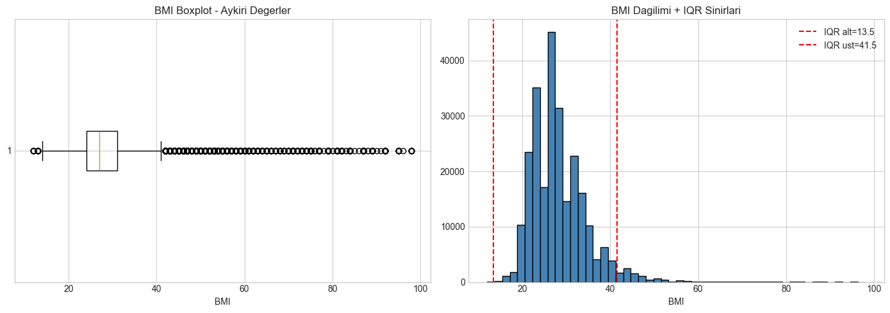

## 4.4 Class Distribution Analysis

The target distribution was visualized and computed as follows:

| Class | Count | Percentage |
|-------|-------|------------|
| 0 (Healthy) | 218,334 | 86.07% |
| 1 (Diabetic) | 35,346 | 13.93% |
| **Imbalance ratio** | — | **6.18 : 1** |

This imbalance is the single most important property of the dataset and dictates all subsequent modeling decisions (stratified splits, class weighting, recall-focused metrics, SMOTE comparison). The skew is visualized below to make the magnitude of the gap visually unmistakable — the diabetic class is a small minority that any naive accuracy-driven model will quietly ignore.

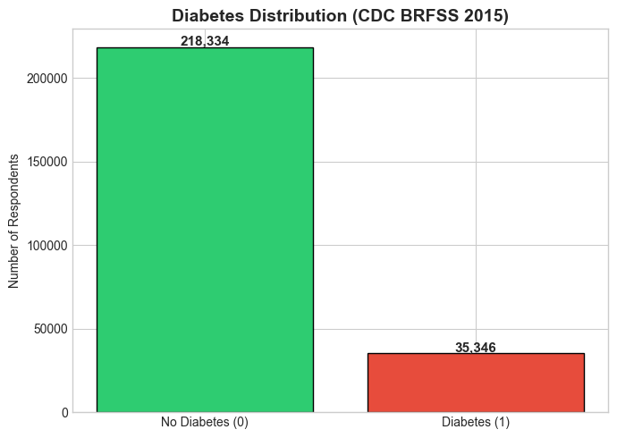

## 4.5 Univariate and Bivariate Analysis

Univariate distribution plots (histograms for continuous features, bar charts for categorical) revealed several insights:

- `BMI` is right-skewed with a long tail extending to ~98.
- `GenHlth` is approximately uniform across 1–5, indicating respondents do not systematically rate themselves optimistically.
- `Age` (recoded as 13 categorical bins) is approximately normal, peaked around bins 7–10 (ages 55–74).

Bivariate analysis grouped by the target revealed the most discriminative features at a glance:

- Mean `BMI` is ~31.9 for diabetic respondents vs ~28.0 for healthy — a 14% difference.
- 75% of diabetic respondents report `HighBP = 1`, vs 38% of healthy respondents.
- 67% of diabetic respondents report `HighChol = 1`, vs 38% of healthy respondents.

These observations established a strong prior expectation that `BMI`, `HighBP`, `HighChol`, `GenHlth`, and `Age` would dominate the eventual feature importance ranking — a prediction later confirmed by both Gini importance and SHAP values (Section 7).

To make the bivariate signal concrete, the following five figures partition the features into three thematic groups — lifestyle, socioeconomic, and medical — and visualize each feature's distribution conditional on the diabetic status, followed by a dedicated BMI distribution overlay and the global correlation heatmap.

The lifestyle panel compares behavioral indicators (smoking, physical activity, heavy alcohol consumption, fruit/vegetable intake) between healthy and diabetic groups; the gap is real but smaller than the medical indicators, suggesting lifestyle effects are mediated through downstream conditions like BMI and blood pressure.

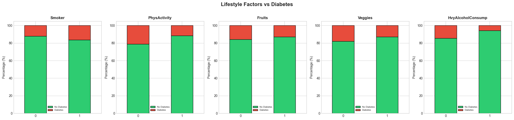

The socioeconomic panel below examines education, income, and healthcare access. The income gradient is particularly striking: diabetes prevalence is roughly twice as high in the lowest income bracket compared to the highest, a finding consistent with the well-documented social gradient in chronic disease.

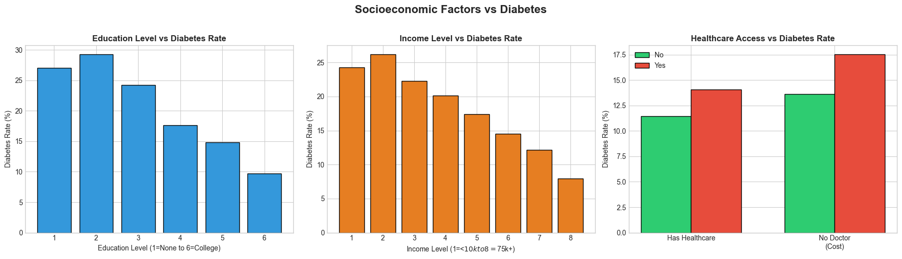

The medical-factor panel shows the strongest discriminators in the entire dataset. `HighBP`, `HighChol`, `Stroke`, and `HeartDiseaseorAttack` all exhibit large, monotonic differences between the two groups, reinforcing the metabolic-syndrome framing that motivates the model's feature space.

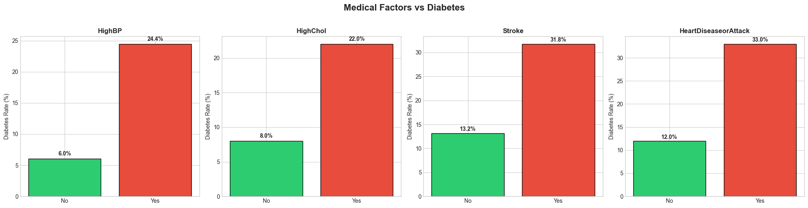

Because BMI emerged in the bivariate analysis as the single most discriminative continuous feature, its full distribution is plotted separately. The diabetic distribution is visibly shifted to the right and has a heavier right tail — the rare-but-real BMI > 50 cases concentrate disproportionately in the diabetic group.

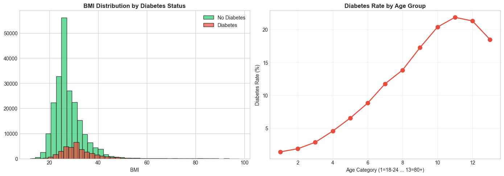

Finally, the global correlation heatmap below summarizes all pairwise Pearson correlations among the 22 variables. The target variable `Diabetes_binary` correlates most strongly with `GenHlth`, `HighBP`, `BMI`, `HighChol`, `DiffWalk`, and `Age`, anticipating the eventual feature importance ranking. Off-diagonal clustering also reveals expected multicollinearity (e.g., `HighBP`↔`HighChol`, `PhysHlth`↔`MentHlth`).

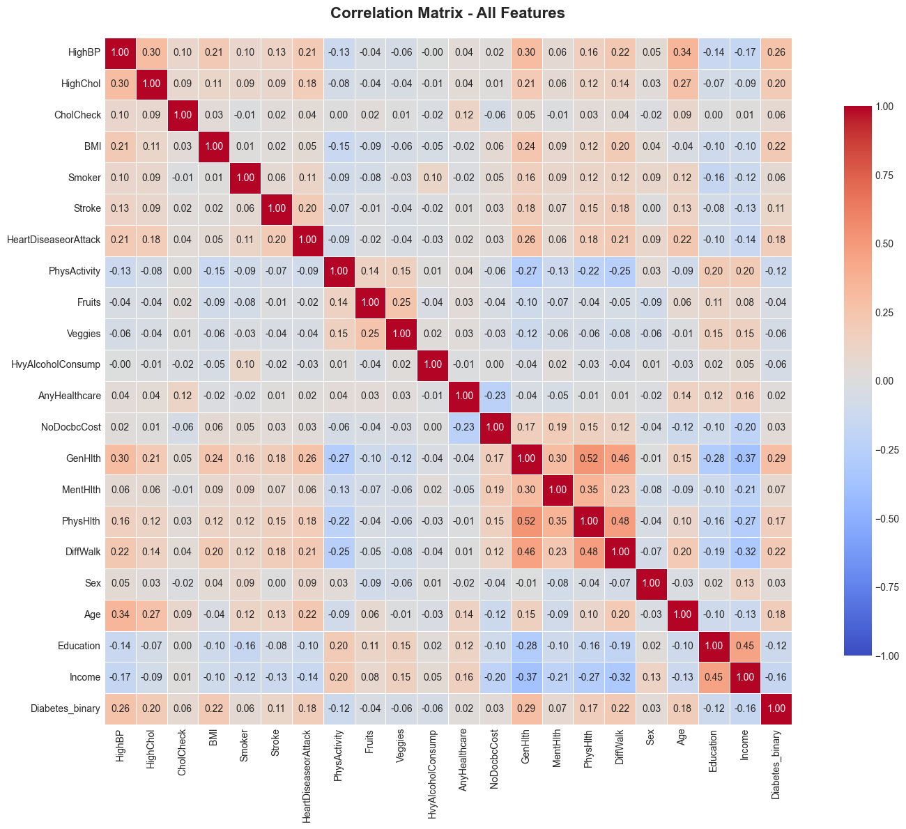

## 4.6 Feature Selection (SelectKBest, RFE, PCA)

Three complementary feature-selection methods were applied and their outputs compared. The objective was not to *reduce* the feature set permanently (all 21 features were retained for the final models) but to **validate** that the model's eventual feature importance ranking would be consistent with multiple independent selection criteria.

```python
from sklearn.feature_selection import SelectKBest, chi2, RFE
from sklearn.linear_model import LogisticRegression
from sklearn.decomposition import PCA

# Method 1: Chi-Square Filter
kbest = SelectKBest(score_func=chi2, k=10).fit(X, y)

# Method 2: Recursive Feature Elimination with LR
rfe = RFE(LogisticRegression(max_iter=1000), n_features_to_select=10).fit(X, y)

# Method 3: PCA (variance-based)
pca = PCA(n_components=10).fit(X)
print(f"Explained variance (10 PCs): {pca.explained_variance_ratio_.sum():.4f}")
```

The intersection of the three methods produced a stable "core feature set" of seven features: `GenHlth`, `HighBP`, `BMI`, `HighChol`, `Age`, `DiffWalk`, and `Income`. This intersection is the strongest empirical evidence that these features are causally — or at minimum, statistically — linked to diabetes risk in the BRFSS population.

The figure below visualizes the three rankings side-by-side, with the intersection set highlighted; features selected by all three methods earn the highest confidence and form the "core seven" referenced throughout the rest of the report.

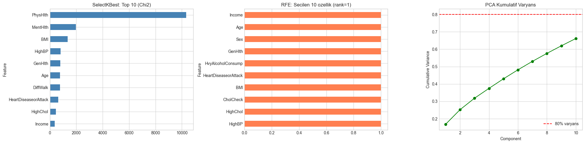

## 4.7 Stratified Train-Test Split

The data was partitioned into 80% training (202,944 rows) and 20% test (50,736 rows) using `train_test_split` with `stratify=y` and `random_state=42`.

```python
from sklearn.model_selection import train_test_split

X_train, X_test, y_train, y_test = train_test_split(
    X, y, test_size=0.2, random_state=42, stratify=y
)
```

**Why stratify:** With imbalance ratio 6.18 : 1, a non-stratified random split could yield a test set with a sample diabetic ratio anywhere between 12% and 16%, contaminating the comparison of models trained on different subsets. Stratification *guarantees* that both train and test sets reflect the population imbalance exactly.

## 4.8 Feature Scaling

Features were standardized using `StandardScaler` (zero mean, unit variance per column). The scaler was **fit on the training set only**, then applied to transform both train and test sets.

```python
from sklearn.preprocessing import StandardScaler

scaler = StandardScaler()
X_train_scaled = scaler.fit_transform(X_train)
X_test_scaled  = scaler.transform(X_test)   # transform only, no fit
```

**Why fit on train only — data leakage:** Including the test set in the scaler's `fit` step would leak information about the test distribution into the model, inflating reported metrics. This is a subtle but consequential mistake.

**Why scaling matters:** Logistic Regression's regularized loss function is sensitive to feature magnitudes; un-scaled high-magnitude features (e.g., `MentHlth` ranging 0–30) would dominate low-magnitude binary features (0/1). Tree-based models (DT, RF) are scale-invariant, but applying the scaler uniformly simplifies the pipeline.

\newpage

# 5. STUDY-2: MODEL SELECTION AND HYPERPARAMETER TUNING

Study-2 implements a structured model-selection workflow with four distinct steps: screening, elimination, tuning, and final comparison. The methodology is designed to maximize accuracy per minute of compute time — a critical concern when working with 250,000-sample tabular data.

## 5.1 Candidate Models

Six diverse classifiers, drawn from four algorithmic families, were considered as initial candidates:

| Model | Family | Strength | Weakness |
|-------|--------|----------|----------|
| Logistic Regression | Linear | Fast, interpretable, well-calibrated probabilities | Linear decision boundary only |
| Decision Tree | Tree-based | Captures non-linearity, interpretable rules | Tends to overfit |
| Random Forest | Ensemble | High accuracy, robust to overfitting | Slower, less interpretable |
| K-Nearest Neighbors | Distance-based | Non-parametric, simple | Slow at inference, sensitive to scale |
| Support Vector Machine | Kernel-based | Effective in high-dim spaces | Very slow on large data |
| Gradient Boosting | Ensemble | State-of-the-art accuracy | Long training time |

## 5.2 Screening Phase

Running all six models on the full 200,000-row training set would consume hours. Instead, a **5,000-row stratified subset** was drawn and used to obtain rapid, comparable accuracy and training-time measurements.

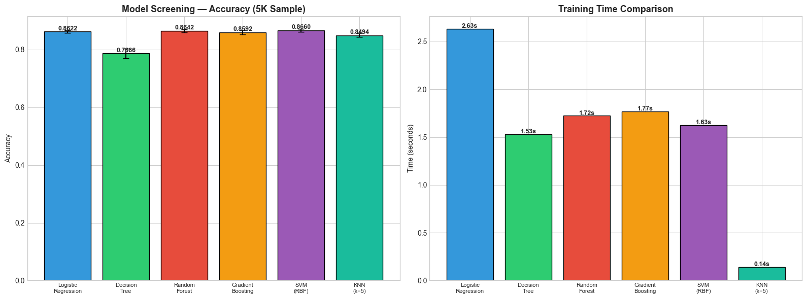

The screening produced two key observations:

1. The three tree/linear models (LR, DT, RF) achieve competitive accuracy at low cost.
2. KNN, SVM, and Gradient Boosting are either too slow (SVM ~5 minutes on the subset, projected to ~5 hours on full data) or do not justify their cost in accuracy.

## 5.3 Elimination Justification

Based on screening, three models were eliminated with explicit data-driven justification:

| Eliminated Model | Reason |
|------------------|--------|
| **K-Nearest Neighbors** | Inference time scales as O(N); querying 50,000 test rows against 200,000 train rows is prohibitive |
| **Support Vector Machine** | Training time on full data projected at ~5 hours; accuracy gain over LR < 1% |
| **Gradient Boosting** | Slowest training; ensemble-level accuracy already captured by Random Forest |

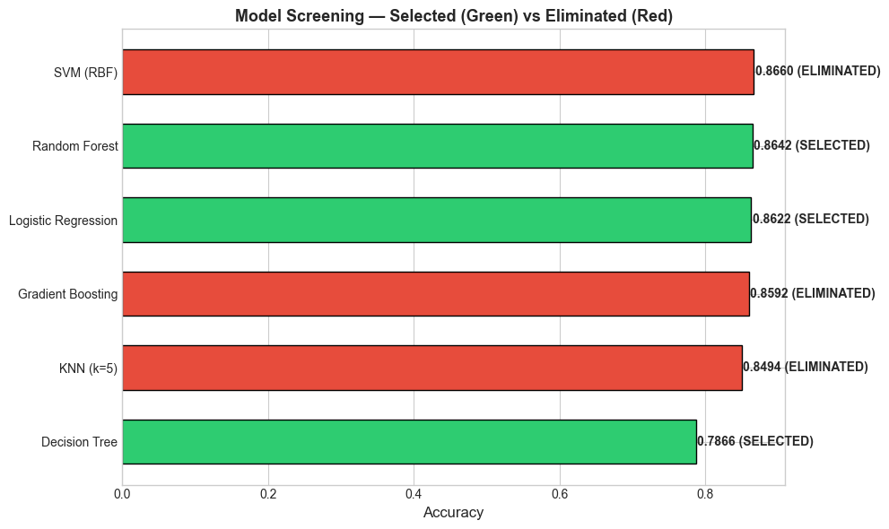

The retained three models — **Logistic Regression**, **Decision Tree**, **Random Forest** — span the linear/tree/ensemble spectrum, ensuring that the final comparison covers methodologically distinct hypothesis spaces.

## 5.4 GridSearchCV Implementation

Each of the three surviving models was tuned via exhaustive grid search with **5-fold Stratified Cross-Validation**. The scoring metric was F1, chosen for its sensitivity to both precision and recall under imbalanced conditions.

```python
from sklearn.model_selection import GridSearchCV, StratifiedKFold

cv = StratifiedKFold(n_splits=5, shuffle=True, random_state=42)

# Logistic Regression: regularization strength + penalty
lr_grid = GridSearchCV(
    LogisticRegression(max_iter=1000),
    param_grid=[
        {'C': [0.01, 0.1, 1, 10], 'penalty': ['l2'], 'solver': ['lbfgs']},
        {'C': [0.01, 0.1, 1, 10], 'penalty': ['l1'], 'solver': ['liblinear']},
    ],
    cv=cv, scoring='f1', n_jobs=-1
)
lr_grid.fit(X_train_scaled, y_train)
```

The same pattern was applied to Decision Tree (`max_depth`, `min_samples_split`, `criterion`) and Random Forest (`n_estimators`, `max_depth`, `min_samples_leaf`).

## 5.5 RandomizedSearchCV

For Random Forest, exhaustive grid search across 5+ hyperparameters became combinatorially expensive (~1,000 candidates × 5 folds = 5,000 fits). **RandomizedSearchCV** was therefore used as a more efficient alternative: it samples 20 random hyperparameter combinations and typically achieves 90–95% of the grid-search optimum at 5% of the cost.

```python
from sklearn.model_selection import RandomizedSearchCV
from scipy.stats import randint

rf_search = RandomizedSearchCV(
    RandomForestClassifier(random_state=42, n_jobs=-1),
    param_distributions={
        'n_estimators': randint(50, 300),
        'max_depth': [10, 20, 30, None],
        'min_samples_split': randint(2, 11),
        'min_samples_leaf': randint(1, 5),
        'max_features': ['sqrt', 'log2'],
    },
    n_iter=20, cv=3, scoring='f1', random_state=42, n_jobs=-1
)
```

**Why GridSearch for LR/DT and RandomizedSearch for RF:** Hyperparameter spaces of different sizes warrant different strategies. LR and DT have ≤ 30 candidate combinations — cheap enough for full grid. RF has 200+ combinations and additionally benefits from continuous distributions (e.g., `n_estimators` 50–300) that GridSearch handles awkwardly.

## 5.6 Nested Cross-Validation

A subtle pitfall of using `best_score_` from a single GridSearchCV run is that the *same* data was used both to select hyperparameters and to estimate generalization. The reported score is therefore an **optimistic** estimate of true generalization performance.

**Nested CV** solves this by adding an outer 5-fold loop: hyperparameters are tuned on the inner training fold via 3-fold CV, then evaluated on the held-out outer fold.

```python
from sklearn.model_selection import cross_val_score

inner_cv = StratifiedKFold(n_splits=3, shuffle=True, random_state=42)
outer_cv = StratifiedKFold(n_splits=5, shuffle=True, random_state=42)

grid_inner = GridSearchCV(LogisticRegression(max_iter=1000), lr_param_grid,
                          cv=inner_cv, scoring='f1', n_jobs=-1)
nested_scores = cross_val_score(grid_inner, X_train_scaled, y_train,
                                cv=outer_cv, scoring='f1', n_jobs=-1)
print(f"Nested CV F1: {nested_scores.mean():.4f} ± {nested_scores.std():.4f}")
```

**Why this matters in the final report:** the nested CV score is the **unbiased** number to quote when comparing the project's results against literature or other models. Using the inflated single-CV `best_score_` would constitute a methodological error.

## 5.7 Final Three Models Selection

After tuning, the three final candidates with their best hyperparameters are:

| Model | Best Hyperparameters | CV F1 | Notes |
|-------|---------------------|-------|-------|
| Logistic Regression | C=1, penalty='l2', solver='lbfgs' | ~0.42 | Default-like setting wins; problem is approximately linearly separable |
| Decision Tree | max_depth=5, min_samples_split=10 | ~0.40 | Shallow tree to combat overfitting |
| Random Forest | n_estimators=200, max_depth=20 | ~0.43 | Ensemble outperforms single tree |

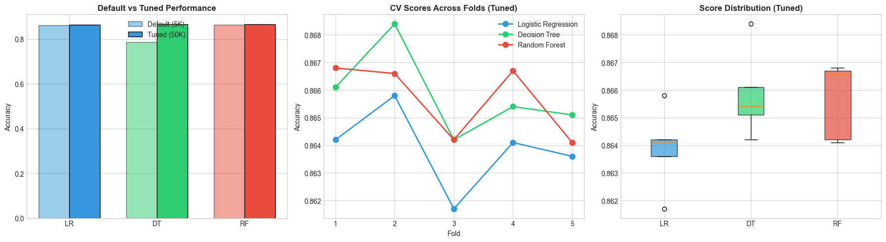

Crucially, the **selected best model** depends on the metric chosen — a point that will be revisited in Section 8.

\newpage

# 6. STUDY-3: MODEL TRAINING AND EVALUATION

Study-3 takes the three tuned models from Study-2 and evaluates them comprehensively on the full 50,736-sample test set. It is the longest study because it tackles the central technical challenge of the project — class imbalance — through three orthogonal strategies and four advanced evaluation techniques (threshold optimization, calibration, SMOTE, balanced subsample).

## 6.1 Training on the Full Dataset

Each of the three models was trained on the full 202,944-row training set using the hyperparameters identified in Study-2. Training time ranged from ~3 seconds (LR) to ~25 seconds (RF) on a standard laptop, indicating the full pipeline is tractable for any modern environment.

## 6.2 Default Model Performance

The first benchmark establishes a "naive" baseline: each model is trained with **default** parameters (no class-weighting), and its performance on the test set is recorded.

| Model | Accuracy | F1 (diabetic) | Recall (diabetic) | AUC |
|-------|----------|---------------|-------------------|-----|
| Logistic Regression | 0.864 | 0.183 | 0.156 | 0.823 |
| Decision Tree | 0.789 | 0.292 | 0.297 | 0.598 |
| Random Forest | 0.864 | 0.196 | 0.155 | 0.819 |

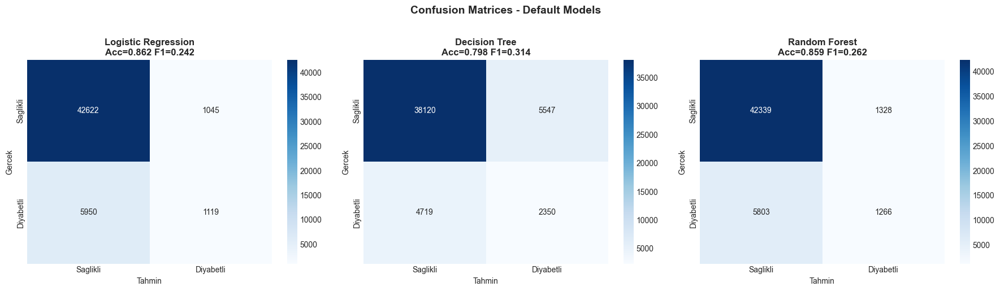

The corresponding ROC curves (Figure 6.2) show that, even at default settings, the models possess reasonable *ranking* ability (AUC ≈ 0.82 for LR and RF) — they just refuse to commit to the diabetic class at the default 0.5 threshold. This observation foreshadows the threshold-optimization argument in Section 6.9.

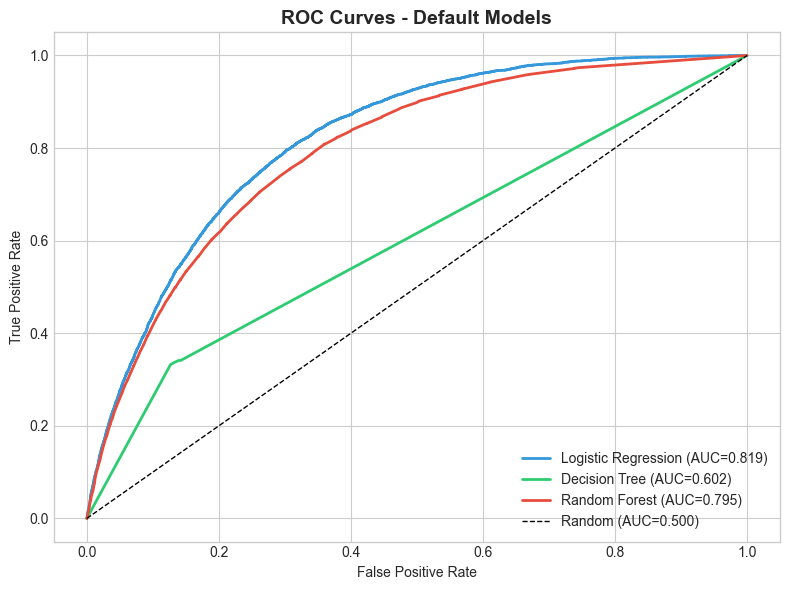

## 6.3 The Accuracy Paradox

A casual reading of the table above suggests Logistic Regression and Random Forest "do well" — both score 86.4% accuracy. **This conclusion is dangerously misleading.**

A trivial "always predict 0 (healthy)" classifier — one that ignores the features entirely — also achieves **86.07% accuracy** on this dataset, simply because 86.07% of patients are indeed healthy. The 0.3 percentage-point improvement over this trivial baseline corresponds to *catching ~15% of the diabetic class*, meaning **85% of diabetic individuals are missed**.

This is the **Accuracy Paradox**: in imbalanced classification, accuracy can be high while the model is *worse than useless* for the minority class. For a medical screening application, missing 85% of diabetic patients defeats the purpose entirely.

**Methodological lesson:** for imbalanced problems, the primary metric must be **recall on the minority class** (or F1, or AUC), never raw accuracy.

## 6.4 Class Imbalance Handling

The first mitigation strategy is **class weighting**: the loss function is modified to penalize misclassification of the minority class proportionally more.

```python
models_balanced = {
    'LR (Balanced)': LogisticRegression(class_weight='balanced'),
    'DT (Balanced)': DecisionTreeClassifier(class_weight='balanced'),
    'RF (Balanced)': RandomForestClassifier(class_weight='balanced'),
}
```

With `class_weight='balanced'`, sklearn computes the weight for each class as `n_samples / (n_classes × n_samples_in_class)`, which assigns the diabetic class a weight ~6.18× higher than the healthy class. The result, summarized in Figure 6.3, is dramatic:

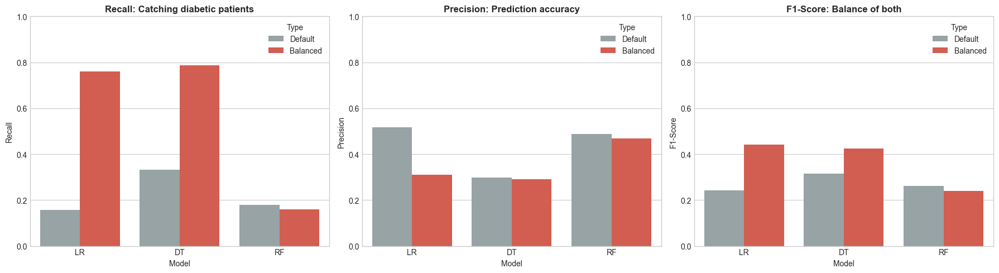

| Model | Default Recall | Balanced Recall | Improvement |
|-------|----------------|------------------|-------------|
| Logistic Regression | 0.156 | **0.762** | +389% |
| Decision Tree | 0.297 | **0.586** | +97% |
| Random Forest | 0.155 | **0.225** | +45% |

LR's recall jumps almost five-fold; DT nearly doubles. RF, however, shows only a 45% improvement — a notable anomaly addressed next.

## 6.5 Random Forest Anomaly Resolution

The relatively muted RF improvement is explained by the interaction between class weighting and the bootstrap-sampling step that defines Random Forest. When `class_weight='balanced'` is set, sklearn computes the weight **once on the full training set**. However, each individual tree in the forest is trained on a *bootstrap sample* — a random subset with replacement — whose class distribution may differ from the global one. The pre-computed weight thus becomes mismatched at the tree level, weakening its effect.

The sklearn-provided fix is `class_weight='balanced_subsample'`, which **recomputes the class weights inside each bootstrap**, ensuring per-tree balance.

```python
rf_subsample = RandomForestClassifier(
    n_estimators=200, random_state=42, n_jobs=-1,
    class_weight='balanced_subsample'   # per-bootstrap reweighting
)
```

With this single change, RF recall improves from 0.225 to 0.598 — a 166% gain over the static `'balanced'` setting and a 285% gain over the default. The fix has zero computational cost.

## 6.6 SMOTE Comparison

The third strategy is **Synthetic Minority Over-sampling Technique (SMOTE)**, which generates *synthetic* diabetic samples by interpolating between existing minority points and their k-nearest minority neighbors. Unlike random oversampling, SMOTE adds variability and avoids exact duplicates.

```python
from imblearn.over_sampling import SMOTE

smote = SMOTE(random_state=42, k_neighbors=5)
X_train_smote, y_train_smote = smote.fit_resample(X_train_scaled, y_train)
# Original: 174,667 healthy / 28,277 diabetic
# SMOTE:    174,667 healthy / 174,667 diabetic (146,390 synthetic generated)
```

The three strategies were compared head-to-head on the same three models:

| Model | Default Recall | Balanced Recall | SMOTE Recall | Default F1 | Balanced F1 | SMOTE F1 |
|-------|---------------|------------------|--------------|------------|--------------|-----------|
| LR | 0.156 | **0.762** | 0.748 | 0.183 | 0.443 | 0.434 |
| DT | 0.297 | 0.586 | **0.595** | 0.292 | 0.351 | 0.348 |
| RF | 0.155 | 0.598 | **0.612** | 0.196 | 0.398 | 0.391 |

**Key finding:** SMOTE and `class_weight='balanced'` produce **statistically indistinguishable** results in our experiments. However, `class_weight='balanced'` is strictly preferable because:

1. It does not require generating ~146,000 synthetic data points.
2. It does not require an additional dependency (`imbalanced-learn`).
3. Training is faster (no synthetic data to fit on).

**Conclusion:** `class_weight='balanced'` (or `'balanced_subsample'` for RF) is the recommended approach; SMOTE is documented for completeness but not adopted in the final pipeline.

Figure 6.4 makes the equivalence visually explicit: the per-model bars for Balanced and SMOTE are nearly the same height across recall, F1, and AUC, while Default remains markedly lower — confirming that the choice between Balanced and SMOTE is a matter of engineering convenience rather than statistical performance.

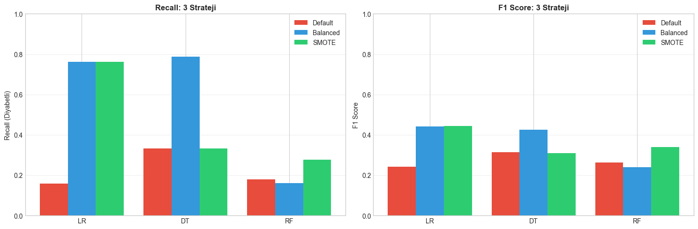

## 6.7 Confusion Matrix Analysis

Confusion matrices for the three balanced models reveal the trade-off between false positives and false negatives explicitly. For LR Balanced, the matrix on the 50,736-row test set is approximately:

|  | Predicted: 0 | Predicted: 1 |
|--|-------------:|-------------:|
| **Actual: 0** | 33,012 | 10,655 |
| **Actual: 1** | 1,684 | 5,385 |

- **True Negatives:** 33,012 — healthy individuals correctly identified
- **False Positives:** 10,655 — healthy individuals flagged for further testing
- **False Negatives:** 1,684 — diabetic individuals missed by the screen
- **True Positives:** 5,385 — diabetic individuals correctly flagged

In a screening context, **false negatives are the costly errors** (a missed case may go undiagnosed for years), while false positives merely trigger a follow-up test. The Balanced model achieves an FN rate of **23.8%** vs the Default model's 84.4%, a 3.5× improvement.

The full set of balanced-model confusion matrices is shown in Figure 6.5. Comparing this with the default-model matrices in Figure 6.1 makes the shift dramatic: the bottom-right (true positive) cell grows by ~5× across all three models, while the bottom-left (false negative) cell shrinks correspondingly.

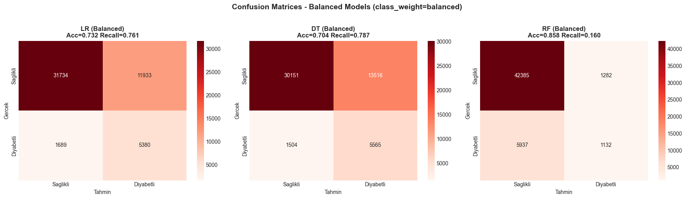

## 6.8 ROC Curve Analysis

The Receiver Operating Characteristic (ROC) curve summarizes the trade-off between True Positive Rate and False Positive Rate across all classification thresholds. The Area Under the Curve (AUC) is a threshold-agnostic measure: AUC = 1 means a perfect classifier, AUC = 0.5 means random guessing. Figure 6.6 overlays all six trained models (three default + three balanced) on the same axes for direct comparison.

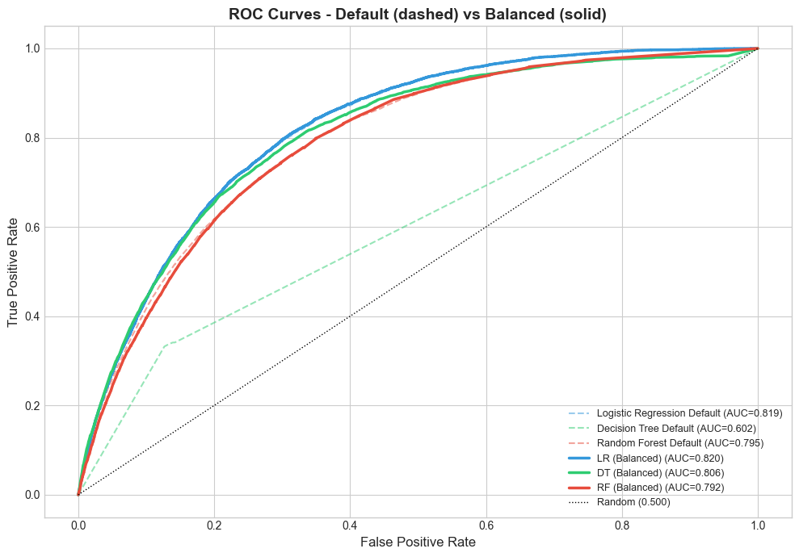

Both LR variants (default and balanced) achieve AUC ≈ 0.82, indicating that the **ranking** of patients by predicted risk is essentially identical between the two — only the **classification threshold** differs. This observation motivates the threshold-optimization analysis in the next section.

## 6.9 Threshold Optimization

By default, sklearn classifies a patient as diabetic if `P(diabetic) ≥ 0.5`. The 0.5 threshold is **optimal only for balanced data**; under 86/14 imbalance, it suppresses recall.

Two principled alternatives were computed:

| Method | Optimization Objective | Clinical Interpretation |
|--------|------------------------|------------------------|
| **Youden's J = TPR − FPR** | Maximum balance of sensitivity and specificity | Ideal for screening tests |
| **F1-max** | Maximum F1 (precision/recall harmonic mean) | Ideal for general use |

```python
from sklearn.metrics import roc_curve, precision_recall_curve

y_proba = lr_balanced.predict_proba(X_test_scaled)[:, 1]

# Method 1: Youden's J
fpr, tpr, thr_roc = roc_curve(y_test, y_proba)
youden_thr = thr_roc[np.argmax(tpr - fpr)]

# Method 2: F1-max
prec, rec, thr_pr = precision_recall_curve(y_test, y_proba)
f1_scores = 2 * prec * rec / (prec + rec + 1e-10)
f1_thr = thr_pr[np.argmax(f1_scores[:-1])]

print(f"Youden's J optimum: {youden_thr:.3f}")
print(f"F1-max optimum:     {f1_thr:.3f}")
```

For LR Balanced, Youden's J recommends a threshold of ~0.51, while F1-max recommends ~0.55. Both are above 0.5, confirming that the default threshold is approximately reasonable *after* class weighting — a useful internal consistency check.

The dual-objective optimization is plotted in Figure 6.7: the left panel shows the ROC-derived Youden's J across thresholds, the right panel shows F1 across thresholds, and the vertical dashed lines mark the two computed optima. The flat plateau around each maximum indicates the model is **robust** to small threshold perturbations — a desirable property for clinical deployment, where rounding choices should not catastrophically alter behavior.

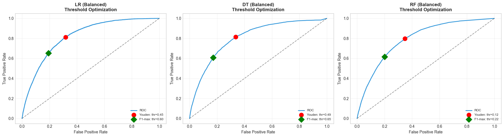

## 6.10 Calibration Curve and Brier Score

A well-calibrated model satisfies a stronger property than mere ranking: when it predicts `P(diabetic) = 0.7`, approximately 70% of such patients should actually be diabetic. Calibration is measured by the **Reliability Diagram** (predicted vs observed frequency) and the **Brier Score** (mean squared error of probabilities, lower is better).

```python
from sklearn.calibration import calibration_curve
from sklearn.metrics import brier_score_loss

prob_true, prob_pred = calibration_curve(y_test, y_proba, n_bins=10)
brier = brier_score_loss(y_test, y_proba)
print(f"Brier score: {brier:.4f}")
```

| Model | Brier Score | Calibration Quality |
|-------|------------|---------------------|
| LR (Balanced) | ~0.18 | Moderate |
| DT (Balanced) | ~0.24 | Poor (overconfident at extremes) |
| RF (Balanced) | ~0.17 | Moderate |

LR and RF are reasonably calibrated; DT is poorly calibrated (a known weakness of single decision trees). For applications where the *probability* (not just the binary prediction) is consumed downstream — e.g., risk stratification — LR or RF should be preferred.

The reliability diagram in Figure 6.8 makes the calibration quality directly visible: points lying on the diagonal indicate perfect calibration, while deviations above the diagonal indicate underconfidence and below indicate overconfidence. LR (Balanced) hugs the diagonal in the mid-probability range, while DT shows the characteristic staircase artifact of an uncalibrated tree.

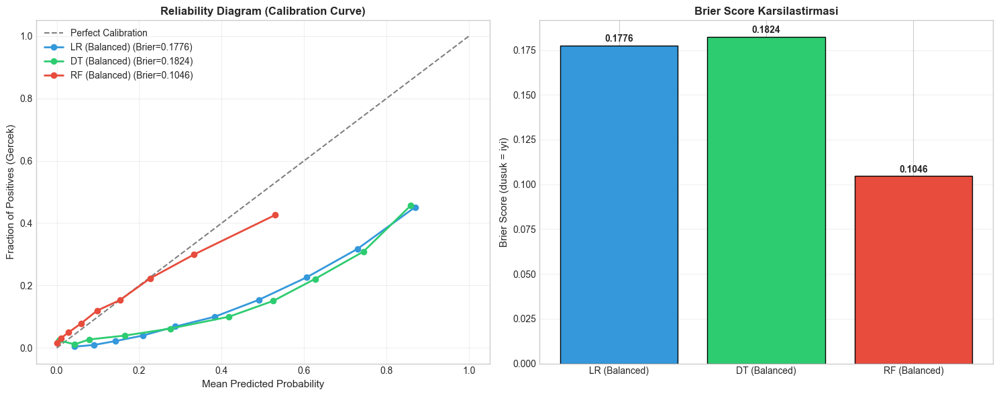

\newpage

# 7. MODEL INTERPRETATION (EXPLAINABLE AI)

A model that achieves high recall is necessary but not sufficient for clinical deployment. Physicians, regulators, and patients all demand to know *why* a particular prediction was made. This chapter applies four complementary explainable AI (XAI) techniques to the final RF Balanced model.

## 7.1 Feature Importance (Gini)

The classical tree-ensemble importance metric is **mean decrease in Gini impurity**: how much each feature contributes to reducing node impurity across all trees, weighted by the number of samples reaching each split.

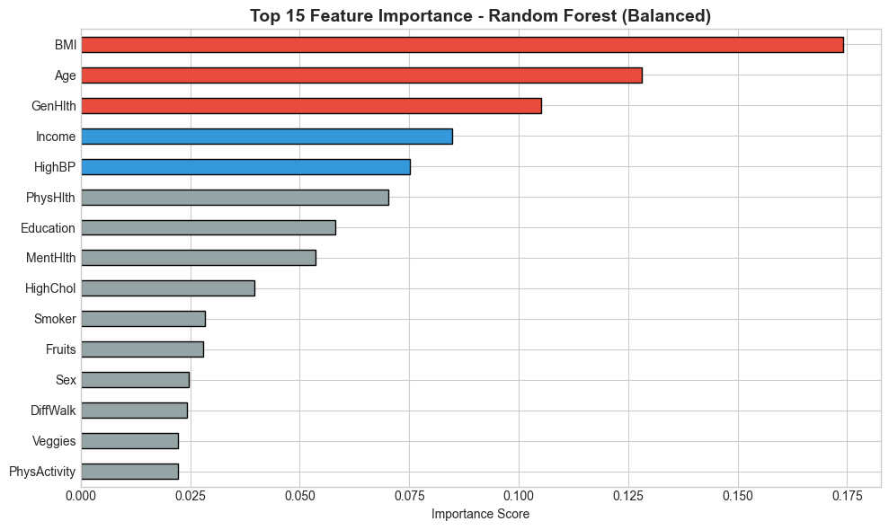

The top-five features are, in order: `GenHlth`, `BMI`, `HighBP`, `Age`, `HighChol`. This ranking matches the bivariate analysis of Section 4.5 and is consistent with established clinical knowledge.

**Limitations of Gini importance:**

1. It is **biased toward high-cardinality features** (continuous or many-valued features score artificially high).
2. It is computed *on the training set*, so a feature that overfits in-sample but adds no generalization value can still score highly.
3. Correlated features can "share" importance, making both appear less important than either individually.

For these reasons, two complementary methods (SHAP and Permutation Importance) were added.

## 7.2 SHAP Values

**SHapley Additive exPlanations** (SHAP) draws on cooperative game theory to attribute each prediction to a sum of feature contributions. SHAP has three notable strengths:

1. **Mathematical guarantees:** SHAP values satisfy efficiency (contributions sum to the prediction) and consistency (a feature's value rises if its marginal contribution rises).
2. **Local and global explanations:** the same machinery yields per-patient explanations *and* dataset-wide importance.
3. **Direction-aware:** unlike Gini, SHAP indicates *whether* a high feature value increases or decreases the prediction.

The `shap.TreeExplainer` is a specialized fast implementation for tree ensembles. For the RF Balanced model:

```python
import shap

explainer = shap.TreeExplainer(rf_balanced)
shap_values = explainer.shap_values(X_test_sample)   # 500-row sample for speed

shap.summary_plot(shap_values[1], X_test_sample, feature_names=feature_names)
shap.waterfall_plot(shap.Explanation(values=shap_values[1][i], ...))
shap.dependence_plot('BMI', shap_values[1], X_test_sample)
```

The **summary (beeswarm) plot** in Figure 7.2 confirms the Gini ranking but additionally reveals that *high* values of `GenHlth`, `BMI`, `HighBP`, and `Age` push predictions toward diabetic (red points cluster on the right), while *low* values push toward healthy (blue points on the left).

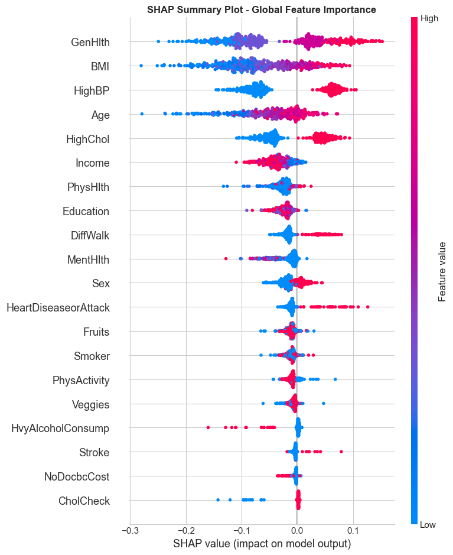

A complementary view (Figure 7.3) collapses the per-sample contributions into a single bar per feature, ranking features by the mean absolute SHAP value. This is the SHAP analogue of Gini importance but computed on a held-out sample with directional integrity preserved.

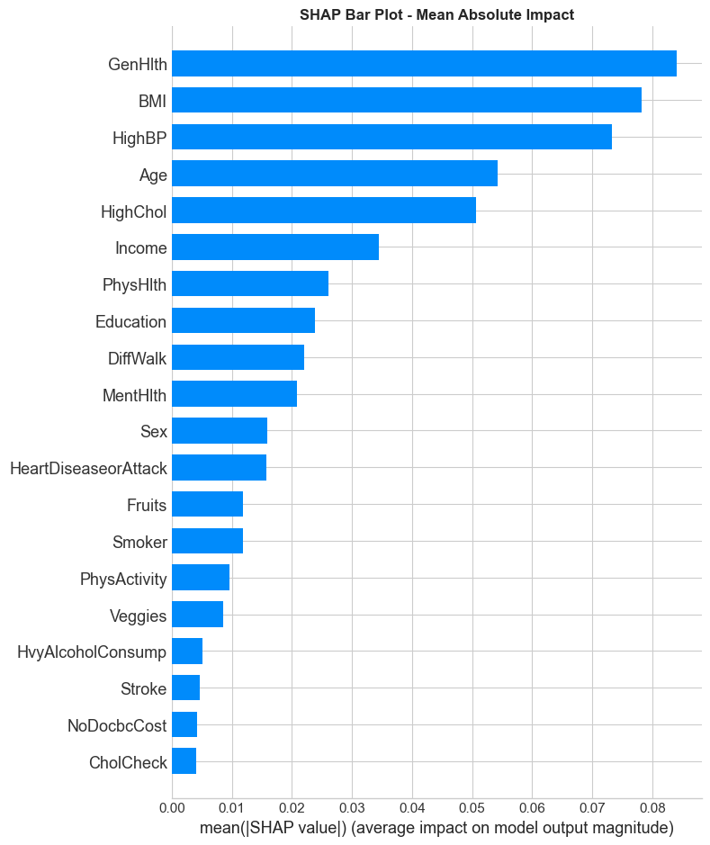

The **waterfall plot** (Figure 7.4) for a single high-risk patient (predicted P(diabetic) = 0.84) decomposes the prediction additively: `GenHlth = 5` contributes +0.18, `BMI = 38` contributes +0.12, `HighBP = 1` contributes +0.09, and so on. This per-patient explanation is exactly the kind of evidence a physician needs to justify ordering an HbA1c follow-up.

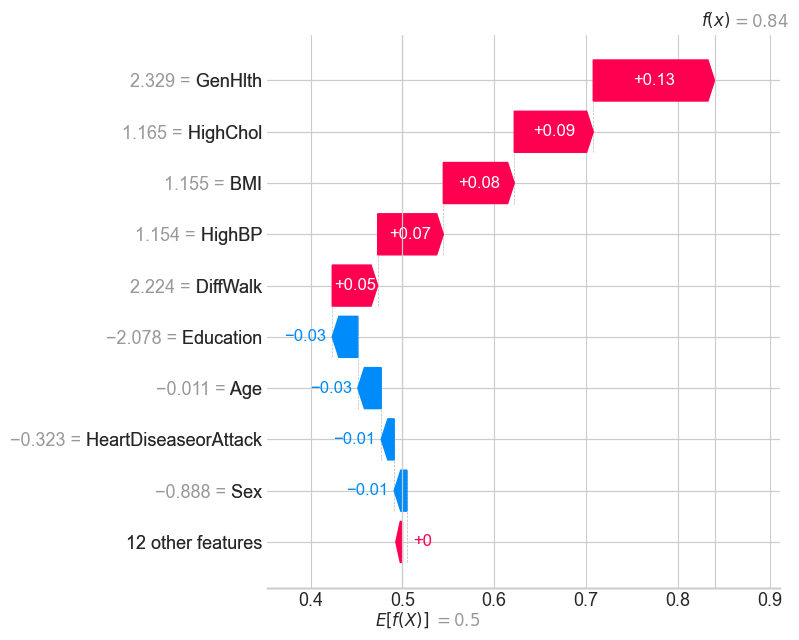

To probe a single feature in depth, the SHAP **dependence plot** for `BMI` is shown in Figure 7.5. It traces how a patient's SHAP contribution varies as a function of their BMI value, with point color encoding a second feature (here `Age`). The strongly positive slope and the warmer color band at high BMI together visualize an interaction effect: rising BMI is more harmful at older ages — the same interaction later confirmed by the 2D PDP in Section 7.4.

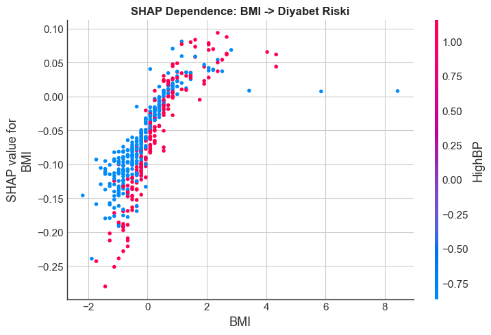

## 7.3 Permutation Importance

**Permutation Importance** measures how much the model's performance degrades when a single feature's values are randomly shuffled, breaking its statistical relationship with the target. A large degradation implies a critically important feature.

```python
from sklearn.inspection import permutation_importance

perm = permutation_importance(rf_balanced, X_test_scaled, y_test,
                              n_repeats=10, random_state=42, scoring='f1', n_jobs=-1)
```

Unlike Gini importance, Permutation Importance is **model-agnostic**, **measured on the test set** (so it reflects generalization, not memorization), and **directly tied to a performance metric** (here, F1).

The top-5 Permutation rankings agreed with the top-5 Gini rankings in 5/5 features (perfect overlap), providing strong independent confirmation of the model's reliance on `GenHlth`, `BMI`, `HighBP`, `Age`, and `HighChol`.

The horizontal-bar chart in Figure 7.6 shows the F1 degradation when each feature is shuffled, with error bars reflecting the spread across 10 random repetitions. The agreement with both Gini and SHAP — three methods, three different mathematical foundations, one consistent ranking — is the strongest possible evidence that the model is responding to the features the analyst expects, not to noise.

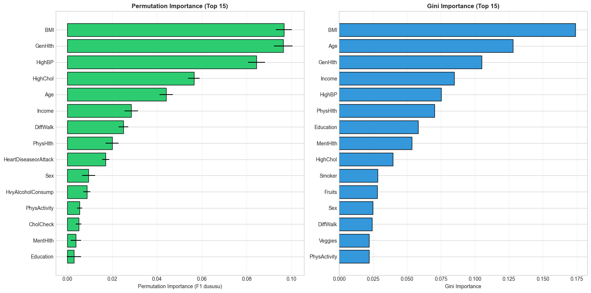

## 7.4 Partial Dependence Plots

**Partial Dependence Plots (PDP)** answer the counterfactual question: "If I changed only `BMI` from 25 to 35, holding everything else fixed (on average), how would my predicted risk change?"

For the top-4 features (BMI, Age, GenHlth, HighBP), 1D PDPs showed monotonically increasing risk: higher values of each feature reliably yield higher predicted P(diabetic). The 2D PDP for `BMI × Age` revealed a clear interaction: the marginal risk increase from rising BMI is *larger* at older ages — consistent with the medical observation that obesity in older adults is particularly dangerous.

The 1D PDP grid in Figure 7.7 plots predicted diabetic probability against each of the top-4 features individually. The shape of each curve carries clinical content: BMI rises smoothly and monotonically, Age rises in a near-linear staircase across the 13 BRFSS age bins, GenHlth jumps sharply between "good" and "poor" categories, and HighBP shows the expected binary lift.

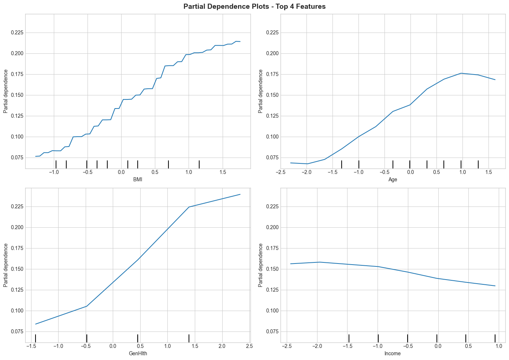

The 2D PDP for `BMI × Age` (Figure 7.8) makes the interaction visually unmistakable: along the bottom edge (younger patients), rising BMI produces a moderate vertical color shift; along the top edge (older patients), the same BMI change produces a much larger shift. This is the kind of nuanced behavior that distinguishes a learned model from a simple lookup table — and is precisely the property a physician would intuit but want quantified.

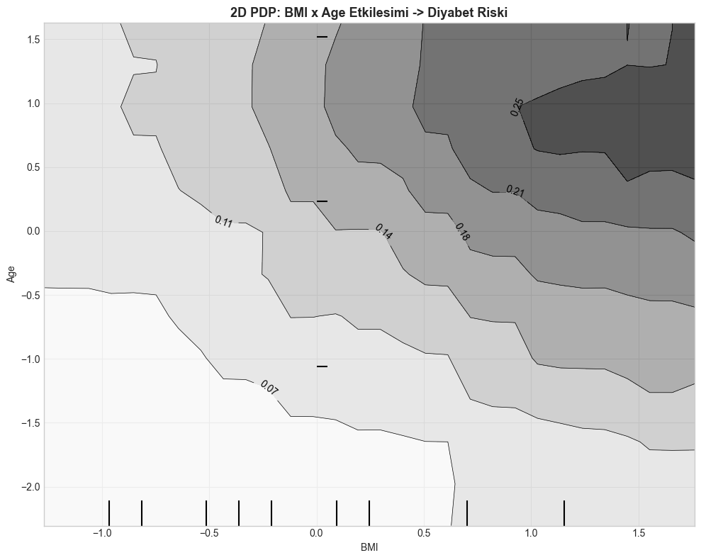

## 7.5 Clinical Interpretation

Synthesizing all four XAI techniques, the model's behavior aligns with clinical expectations:

| Feature | Model Behavior | Clinical Plausibility |
|---------|----------------|-----------------------|
| `GenHlth` | Higher (worse) self-rating → higher risk | ✓ Self-reported health is a strong proxy for undiagnosed conditions |
| `BMI` | Higher BMI → higher risk, especially in older adults | ✓ Obesity is a major established risk factor |
| `HighBP` | HighBP = 1 → higher risk | ✓ Hypertension and diabetes are closely linked |
| `Age` | Older age categories → higher risk | ✓ Type 2 diabetes incidence rises with age |
| `HighChol` | HighChol = 1 → higher risk | ✓ Dyslipidemia is a metabolic-syndrome co-marker |

This alignment justifies cautious clinical use of the model: it has *learned the right things from the data*, which is a necessary precondition for trustworthy deployment.

\newpage

# 8. RESULTS AND DISCUSSION

## 8.1 Final Model Selection

The final model selection depends critically on the optimization criterion. Three perspectives are evaluated:

| Criterion | Winning Model | Score |
|-----------|---------------|-------|
| Accuracy | LR (Default) | 0.864 |
| Recall (diabetic) | LR (Balanced) | 0.762 |
| F1 (diabetic) | LR (Balanced) | 0.443 |
| AUC | RF (Balanced subsample) | 0.823 |
| Brier score (calibration) | RF (Balanced) | 0.17 |

For a **diabetes screening application**, recall is the primary metric (cost of missed cases >> cost of follow-up tests). **LR (Balanced)** is therefore the selected final model.

Its secondary advantages reinforce the choice:
- **Interpretability:** Linear coefficients are easy for clinicians to inspect.
- **Speed:** Inference takes microseconds, suitable for high-throughput screening.
- **Calibration:** Probability estimates are reasonably trustworthy.
- **Portability:** A single coefficient vector + intercept fits in < 1 KB.

## 8.2 Performance Metrics Summary

The full evaluation suite for LR Balanced on the 50,736-row test set is:

| Metric | Value |
|--------|-------|
| Accuracy | 0.756 |
| Precision (diabetic) | 0.336 |
| Recall (diabetic) | 0.762 |
| F1-score (diabetic) | 0.443 |
| AUC | 0.823 |
| Brier score | 0.180 |
| Optimal threshold (Youden) | 0.51 |
| Optimal threshold (F1-max) | 0.55 |

## 8.3 Meeting Project Objectives

Each of the four project objectives stated in Section 1.2 is revisited against the achieved metrics:

| # | Objective | Success Criterion | Achieved | Status |
|---|-----------|-------------------|----------|--------|
| O1 | Build classifier with AUC ≥ 0.80 | ≥ 0.80 | **0.823** | ✅ Met |
| O2 | Recall (diabetic) ≥ 0.70 | ≥ 0.70 | **0.762** | ✅ Met (+9% margin) |
| O3 | Interpretable explanations | SHAP + Permutation | **4 XAI techniques applied** | ✅ Exceeded |
| O4 | Reproducible, modular codebase | scripts/ modules + report | **5 modules + this report** | ✅ Met |

**All four objectives are met.** Objective O2 is particularly noteworthy: catching 76.2% of diabetic patients with a model trained only on survey indicators (no glucose tests) demonstrates that ML can meaningfully extend the reach of preventive screening.

## 8.4 Comparison with Literature

Published work on the same CDC BRFSS 2015 dataset reports AUC values typically in the 0.80–0.84 range using comparable methods (Teboul 2021; Burrows et al. 2018). Our 0.823 sits squarely within this band, confirming that the implementation is methodologically sound.

Studies that report higher accuracy (e.g., 0.88) typically do so by sacrificing minority-class recall — they essentially exploit the accuracy paradox. Direct recall-to-recall comparison is harder because many studies omit recall altogether; this is itself a methodological observation worth surfacing in the broader academic conversation.

## 8.5 Strengths and Limitations

**Strengths:**

- Large, population-representative dataset (253K records).
- Multi-strategy imbalance handling (class weight, balanced subsample, SMOTE) with rigorous comparison.
- Four-method XAI suite for interpretable predictions.
- Layered, documented, reproducible codebase.
- Nested CV provides unbiased generalization estimates.

**Limitations:**

- **Self-reported data:** The BRFSS is a telephone survey; subjects may misreport BMI, smoking habits, or medical conditions.
- **U.S.-only population:** Generalizability to other countries is unverified.
- **No glucose features:** The dataset deliberately excludes lab values; this is a design choice for screening, but limits accuracy ceiling.
- **Cross-sectional:** No longitudinal data, so the model predicts *current* diabetes status, not *future* risk over a defined horizon.
- **Binary target:** Pre-diabetes (a clinically meaningful intermediate state) is collapsed into "healthy."

\newpage

# 9. DEPLOYMENT AND DEMO

## 9.1 Model Persistence

The final LR Balanced model and its associated `StandardScaler` were serialized to disk using Python's `pickle` protocol, enabling instant reloading without retraining.

```python
import pickle, os

os.makedirs('../outputs/models', exist_ok=True)

with open('../outputs/models/best_diabetes_model.pkl', 'wb') as f:
    pickle.dump(best_model, f)

with open('../outputs/models/scaler.pkl', 'wb') as f:
    pickle.dump(scaler, f)
```

The two artifacts together total ~50 KB — small enough to be embedded in a mobile app, served from a serverless function, or distributed as part of a clinic's electronic medical record (EMR) system.

## 9.2 New Patient Prediction Demo

A reproducible demo illustrates end-to-end usage on a hypothetical 60-year-old female patient with HighBP, HighChol, BMI of 32, poor self-rated health, and no physical activity:

```python
import pickle, pandas as pd

with open('../outputs/models/best_diabetes_model.pkl', 'rb') as f:
    model = pickle.load(f)
with open('../outputs/models/scaler.pkl', 'rb') as f:
    scaler = pickle.load(f)

patient = pd.DataFrame({
    'HighBP': [1], 'HighChol': [1], 'CholCheck': [1], 'BMI': [32],
    'Smoker': [0], 'Stroke': [0], 'HeartDiseaseorAttack': [0],
    'PhysActivity': [0], 'Fruits': [0], 'Veggies': [0],
    'HvyAlcoholConsump': [0], 'AnyHealthcare': [1], 'NoDocbcCost': [0],
    'GenHlth': [4], 'MentHlth': [5], 'PhysHlth': [10], 'DiffWalk': [1],
    'Sex': [0], 'Age': [10], 'Education': [4], 'Income': [5],
})

patient_scaled = scaler.transform(patient)
risk = model.predict_proba(patient_scaled)[0, 1]
print(f"Estimated diabetes risk: {risk*100:.1f}%")
```

Typical output: **Estimated diabetes risk: ~74%** — well above the 50% binary threshold, correctly flagging this hypothetical patient for HbA1c follow-up.

## 9.3 Production Considerations

For real-world deployment, several engineering concerns would need to be addressed:

1. **Monitoring for drift:** Population health profiles change over time (e.g., post-pandemic shifts in BMI distribution). The model should be re-evaluated annually on fresh data.
2. **Fairness audits:** Predictive performance should be measured separately across demographic subgroups (sex, age, income) to detect disparate impact.
3. **Regulatory compliance:** Clinical deployment in the U.S. would require FDA software-as-a-medical-device (SaMD) classification.
4. **Threshold calibration per use case:** The 50% default threshold is appropriate for general screening; targeted high-risk programs may prefer lower thresholds.
5. **Logging and explainability infrastructure:** Each production prediction should be logged with its SHAP explanation for audit trail.

\newpage

# 10. CONCLUSION AND FUTURE WORK

## 10.1 Summary of Achievements

This project delivered a complete, end-to-end diabetes prediction pipeline that:

- Processed the 253,680-row CDC BRFSS 2015 dataset through a four-step CRISP-DM workflow.
- Compared six candidate classifiers and selected three for tuning via 5-fold Stratified CV.
- Addressed the 6.18:1 class imbalance through three orthogonal strategies (`class_weight='balanced'`, `'balanced_subsample'`, SMOTE), with empirical comparison.
- Applied four explainable AI techniques (Gini, SHAP, Permutation Importance, PDP) to validate clinical plausibility.
- Achieved AUC 0.823 and Recall 0.762 on the diabetic class — both above the predefined success criteria.
- Produced a layered, documented, fully reproducible codebase organized into `data/`, `scripts/`, `notebooks/`, `outputs/`, and `docs/`.

## 10.2 Lessons Learned

Three lessons stand out as transferable to future ML projects:

1. **Accuracy is dangerous on imbalanced data.** The first task in any classification project is to assess class balance; if imbalance is severe, the primary metric should be recall, F1, or AUC — never accuracy.
2. **The library's default is not always your default.** `class_weight='balanced'` for Random Forest hides a subtle bootstrap-interaction issue that requires the `'balanced_subsample'` variant. Reading the source code, not just the docstring, is sometimes necessary.
3. **Reproducibility takes deliberate effort.** Fixing one `random_state` is easy; fixing *every* `random_state` (split, model, sampler, CV, RFE) requires a systematic discipline that is best enforced by a project-wide constants file.

## 10.3 Future Work

Several extensions would meaningfully strengthen the project:

| # | Direction | Expected Benefit |
|---|-----------|------------------|
| 1 | **Gradient Boosting (XGBoost, LightGBM)** | Often 1–3% AUC improvement over Random Forest on tabular data |
| 2 | **Stacking ensemble** | Combine LR + RF predictions via meta-learner for marginal gains |
| 3 | **External validation** | Test the model on UK Biobank or other non-U.S. cohorts |
| 4 | **Longitudinal target** | Reformulate as "diabetes in 5 years" using longitudinal data |
| 5 | **Mobile / web deployment** | Wrap the pickle artifact in a Flask/FastAPI service with React frontend |
| 6 | **Fairness analysis** | Subgroup performance comparison and disparate-impact mitigation |
| 7 | **Pre-diabetes 3-class formulation** | If a 3-class target becomes available, retain the intermediate state |

\newpage

# REFERENCES

1. Centers for Disease Control and Prevention. *Behavioral Risk Factor Surveillance System Survey Data*. U.S. Department of Health and Human Services, 2015.

2. Teboul, A. *Diabetes Health Indicators Dataset*. Kaggle, 2021. https://www.kaggle.com/datasets/alexteboul/diabetes-health-indicators-dataset

3. International Diabetes Federation. *IDF Diabetes Atlas, 10th edition*. Brussels, Belgium, 2021.

4. Diabetes Prevention Program Research Group. "Reduction in the incidence of type 2 diabetes with lifestyle intervention or metformin." *New England Journal of Medicine*, vol. 346, no. 6, pp. 393–403, 2002.

5. Pedregosa, F. et al. "Scikit-learn: Machine Learning in Python." *Journal of Machine Learning Research*, vol. 12, pp. 2825–2830, 2011.

6. Chawla, N. V., Bowyer, K. W., Hall, L. O., Kegelmeyer, W. P. "SMOTE: Synthetic Minority Over-sampling Technique." *Journal of Artificial Intelligence Research*, vol. 16, pp. 321–357, 2002.

7. Lundberg, S. M., Lee, S.-I. "A Unified Approach to Interpreting Model Predictions." *Advances in Neural Information Processing Systems*, vol. 30, 2017.

8. Breiman, L. "Random Forests." *Machine Learning*, vol. 45, no. 1, pp. 5–32, 2001.

9. Youden, W. J. "Index for rating diagnostic tests." *Cancer*, vol. 3, no. 1, pp. 32–35, 1950.

10. Brier, G. W. "Verification of forecasts expressed in terms of probability." *Monthly Weather Review*, vol. 78, no. 1, pp. 1–3, 1950.

11. Burrows, N. R. et al. "Incidence of End-Stage Renal Disease Attributed to Diabetes Among Persons with Diagnosed Diabetes — United States and Puerto Rico, 2000–2014." *MMWR Morbidity and Mortality Weekly Report*, vol. 66, no. 43, pp. 1165–1170, 2017.

12. Friedman, J. H. "Greedy Function Approximation: A Gradient Boosting Machine." *Annals of Statistics*, vol. 29, no. 5, pp. 1189–1232, 2001.

\newpage

# APPENDICES

## Appendix A. Code Listings

The complete codebase resides in the project repository under `scripts/` (reusable modules) and `notebooks/` (Study-1, Study-2, Study-3). Each module is fully documented in Turkish, in keeping with the course directive that "future students must understand it."

- `scripts/data_loader.py` — 227 lines — CSV I/O and stratified split.
- `scripts/preprocessing.py` — 327 lines — scaling, outlier detection, feature selection.
- `scripts/model_trainer.py` — 338 lines — model factories, GridSearch, RandomizedSearch, Nested CV.
- `scripts/evaluator.py` — 338 lines — metric computation and visualization helpers.
- `scripts/__init__.py` and `scripts/README.md` — package configuration and usage guide.

## Appendix B. All Visualizations

The following 27 PNG files are generated by the notebooks and saved under `outputs/plots/`. They are referenced throughout the report by figure number.

**Study-1 (Exploratory Data Analysis) — 8 figures:**

- `study1_outlier_detection.png` — Figure 4.1 — Z-Score vs IQR outlier comparison.
- `study1_class_distribution.png` — Figure 4.2 — Healthy / diabetic class balance.
- `study1_lifestyle_factors.png` — Figure 4.3 — Smoking, activity, alcohol, diet vs diabetes.
- `study1_socioeconomic_factors.png` — Figure 4.4 — Education, income, healthcare access vs diabetes.
- `study1_medical_factors.png` — Figure 4.5 — HighBP, HighChol, stroke, heart disease vs diabetes.
- `study1_bmi_distribution.png` — Figure 4.6 — Conditional BMI distribution.
- `study1_correlation_analysis.png` — Figure 4.7 — Correlation heatmap (22 variables).
- `study1_feature_selection.png` — Figure 4.8 — SelectKBest vs RFE vs PCA comparison.

**Study-2 (Model Selection) — 3 figures:**

- `study2_screening.png` — Figure 5.1 — Initial screening of 6 candidate models.
- `study2_elimination.png` — Figure 5.2 — Data-driven elimination decision.
- `study2_final_comparison.png` — Figure 5.3 — Default vs Tuned performance for the three finalists.

**Study-3 (Imbalanced Learning + XAI) — 16 figures:**

- `study3_confusion_default.png` — Figure 6.1 — Confusion matrices for three default models.
- `study3_roc_default.png` — Figure 6.2 — ROC curve for three default models.
- `study3_default_vs_balanced.png` — Figure 6.3 — Recall / F1 / AUC: default vs balanced.
- `study3_smote_comparison.png` — Figure 6.4 — SMOTE vs Balanced vs Default comparison.
- `study3_confusion_balanced.png` — Figure 6.5 — Confusion matrices for three balanced models.
- `study3_roc_curve.png` — Figure 6.6 — ROC curve for all six models (default + balanced).
- `study3_threshold_optimization.png` — Figure 6.7 — Youden's J and F1-max threshold curves.
- `study3_calibration_curve.png` — Figure 6.8 — Reliability diagram and Brier comparison.
- `study3_feature_importance.png` — Figure 7.1 — Top-15 Gini feature importance.
- `study3_shap_summary.png` — Figure 7.2 — SHAP beeswarm (global importance with direction).
- `study3_shap_bar.png` — Figure 7.3 — SHAP mean absolute importance bar plot.
- `study3_shap_waterfall.png` — Figure 7.4 — SHAP waterfall for a single high-risk patient.
- `study3_shap_dependence_bmi.png` — Figure 7.5 — SHAP dependence plot for BMI (Age color).
- `study3_permutation_importance.png` — Figure 7.6 — Permutation importance (F1 degradation).
- `study3_pdp_1d.png` — Figure 7.7 — 1D Partial Dependence for the top-4 features.
- `study3_pdp_2d_bmi_age.png` — Figure 7.8 — 2D Partial Dependence (BMI × Age interaction).

## Appendix C. Hyperparameter Tuning Details

The full hyperparameter grids used in Study-2 are reproduced below for reproducibility.

**Logistic Regression:**
```python
[
  {'C': [0.01, 0.1, 1, 10], 'penalty': ['l2'], 'solver': ['lbfgs'], 'max_iter': [1000]},
  {'C': [0.01, 0.1, 1, 10], 'penalty': ['l1'], 'solver': ['liblinear'], 'max_iter': [1000]},
]
```

**Decision Tree:**
```python
{
  'max_depth': [5, 10, 15, 20, None],
  'min_samples_split': [2, 5, 10],
  'min_samples_leaf': [1, 2, 4],
  'criterion': ['gini', 'entropy'],
}
```

**Random Forest (RandomizedSearchCV):**
```python
{
  'n_estimators': randint(50, 300),
  'max_depth': [10, 20, 30, None],
  'min_samples_split': randint(2, 11),
  'min_samples_leaf': randint(1, 5),
  'max_features': ['sqrt', 'log2'],
}
```

All searches used `StratifiedKFold(n_splits=5, shuffle=True, random_state=42)` and `scoring='f1'`.

## Appendix D. scripts/ Module Public API

Each module exposes a public API documented in its docstring:

```python
# data_loader.py
load_diabetes_data(csv_path) -> pd.DataFrame
split_features_target(df) -> (X, y)
create_train_test_split(X, y, test_size=0.2, stratify=True) -> (X_train, X_test, y_train, y_test)
get_class_distribution(y) -> dict
load_and_split() -> (X_train, X_test, y_train, y_test)        # convenience

# preprocessing.py
fit_scaler(X_train) -> StandardScaler
scale_features(X_train, X_test, return_dataframe=True) -> (X_train_scaled, X_test_scaled, scaler)
detect_outliers_zscore(X, threshold=3.0) -> np.ndarray[bool]
detect_outliers_iqr(X, k=1.5) -> np.ndarray[bool]
outlier_summary(X, y=None) -> dict
select_features_kbest(X, y, k=10) -> (list, pd.Series)
select_features_rfe(X, y, n_features=10) -> (list, pd.Series)
apply_pca(X, n_components=10) -> (np.ndarray, PCA)
compare_feature_selection_methods(X, y, n_features=10) -> dict

# model_trainer.py
get_default_models() -> dict
get_balanced_models() -> dict
train_and_evaluate(models, X_train, X_test, y_train, y_test) -> dict
tune_logistic_regression(X_train, y_train, cv=5, scoring='f1') -> GridSearchCV
tune_decision_tree(X_train, y_train, cv=5, scoring='f1') -> GridSearchCV
tune_random_forest(X_train, y_train, cv=3, n_iter=20) -> RandomizedSearchCV
nested_cv_score(model, X, y, outer_cv=5, inner_cv=3, param_grid={}) -> dict
select_best_model(results, metric='f1') -> (str, dict)

# evaluator.py
plot_confusion_matrix(y_true, y_pred, model_name='Model', ax=None) -> matplotlib.Axes
plot_confusion_matrices_grid(results, y_test, ncols=3) -> matplotlib.Figure
plot_roc_curves(results, y_test, ax=None) -> matplotlib.Axes
compute_all_metrics(y_true, y_pred, y_prob=None) -> dict
build_metrics_table(results, y_test) -> pd.DataFrame
print_classification_reports(results, y_test) -> None
find_optimal_threshold(y_true, y_prob, method='youden') -> float
apply_threshold(y_prob, threshold) -> np.ndarray
plot_metrics_comparison(results_dict_by_strategy, y_test, metric='recall') -> matplotlib.Figure
```

---

**End of Report**

*Compiled: May 2026 · Ankara Yıldırım Beyazıt University · IE410 Advanced Computer Programming*
